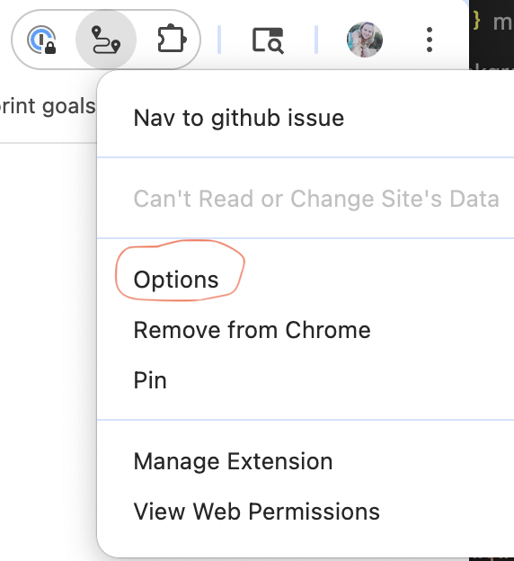
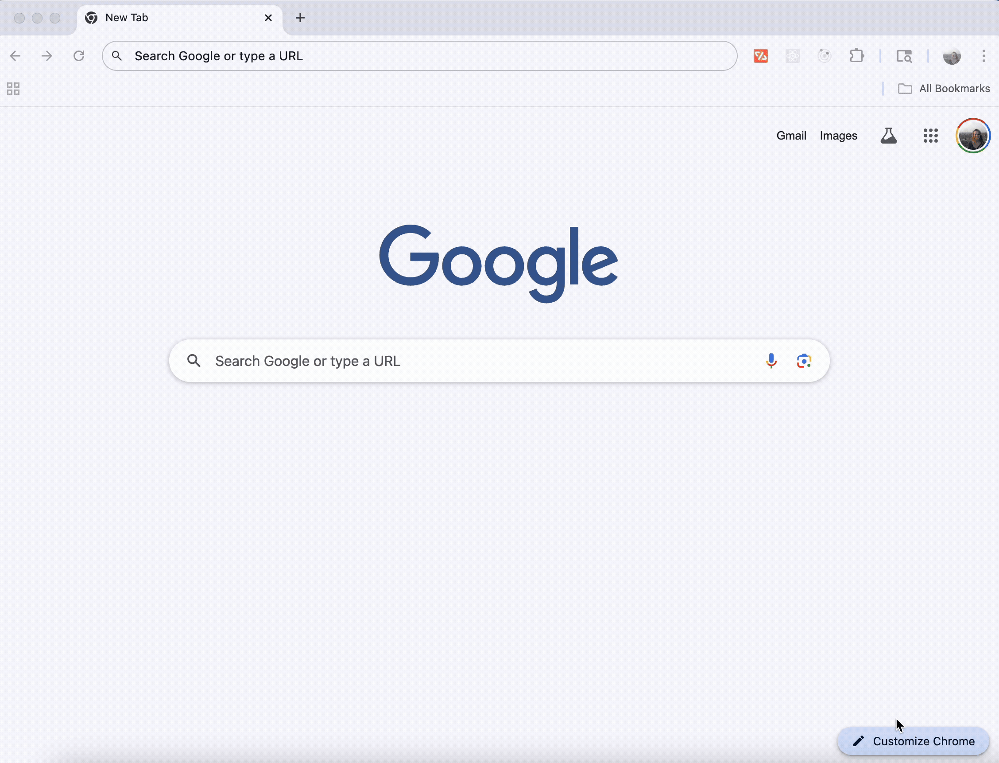

# Github Issue Filler

When this browser extension is enabled, you can type in `i <github issue number>` to more quickly navigate to your github issues.

## Installation
1. Add to Chrome via the [Chrome store](https://chromewebstore.google.com/detail/nav-to-github-issue/hkechgoganegnlfecefldlbinjmhhhni?authuser=0&hl=en&pli=1)
1. Before getting started, make sure to set your github organization and repository name in the extension options

## Demo
Demo of extension in use

## Install in developer mode
This is not needed if you are all set via the web store. That said, if you do want to install via the zip file in Developer Mode, here is how:

1. Download this repo to your computer (or find a [.zip release here](https://github.com/aligg/issue-filler/releases/latest))
1. Open the Extension Management page by navigating to [`chrome://extensions`](chrome://extensions).
1. Enable Developer Mode by clicking the toggle switch next to **Developer mode**.
1. Click the **LOAD UNPACKED** button and select the extension's directory.
1. Navigate to extension options and set your github organization and repository name. For example, if your hypothetical issue link is: https://github.com/aligg/issue-filler/123 your organization would be "aligg" and your repository would be "issue-filler"
1. Restart Chrome

Demo of installing the extension via developer mode

Reminder that in developer mode you'll still need to set your github org and repo in options.

## Permissions
This extension's permissions are limited only to pages on github.com. You can confirm this by viewing the extension's **Details** from the [`chrome://extensions`](chrome://extensions) page.