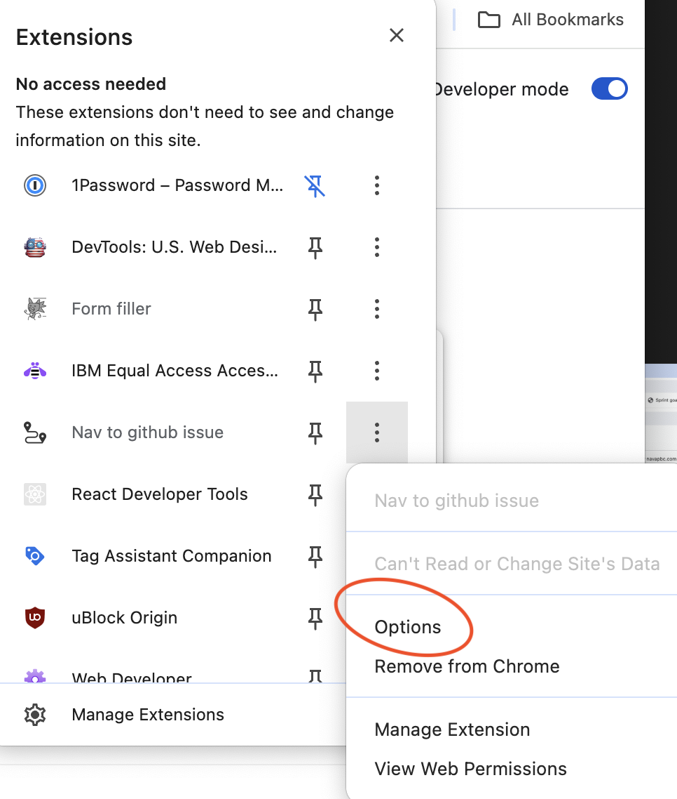

# Github Issue Filler

When this browser extension is enabled, you can type in `i <github issue number>` to more quickly navigate to your github issues.

## Installation

This Chrome extension isn't available through the Chrome Store, therefore you need to manually install it by enabling "Developer Mode":

1. Download this repo to your computer (or find a [.zip release here](https://github.com/aligg/issue-filler/releases/latest))
1. Open the Extension Management page by navigating to [`chrome://extensions`](chrome://extensions).
1. Enable Developer Mode by clicking the toggle switch next to **Developer mode**.
1. Click the **LOAD UNPACKED** button and select the extension's directory.
1. Navigate to extension options and set your github organization and repository name. For example, if your hypothetical issue link is: https://github.com/aligg/issue-filler/123 your organization would be "aligg" and your repository would be "issue-filler"
1. Restart Chrome

Demo of installing the extension:

Screenshot on how to get to options to set your github organization and repository name:

## Demo
Demo of extension in use

## Permissions
This extension's permissions are limited only to pages on github.com. You can confirm this by viewing the extension's **Details** from the [`chrome://extensions`](chrome://extensions) page.